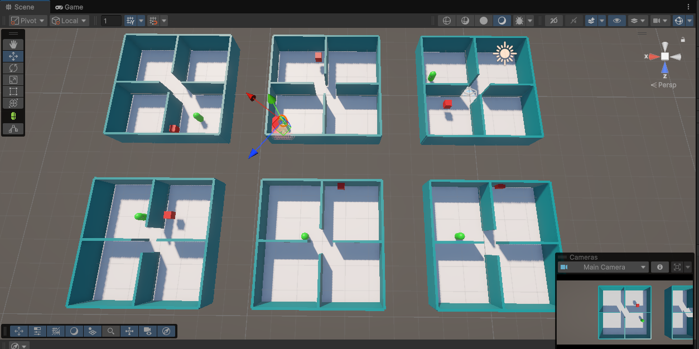

# Escape Of Death
---
## Doel van dit project
In dit project gaan we onze leerstof die we doorheen dit jaar hebben gezien omzetten in een VR-Game met ML-Agents. 

Het idee is dat we insiparie nemen van het spel Dead By Daylight en hier onze eigen versie van maken. 

We zullen dus een agent opzetten ( als "killer" ) die ons in een omgeving zal zoeken en ons zal proberen te vermooorden. Als speler ( in VR ) ga je opzoek naar de sleutel om te ontsnappen hieraan. 

## Fases
Het ontwerp van deze game zal worden opgedeeld in verschillende fases, op deze manier behouden we een goed overzicht en kunnen we snel ingrijpen indien er moeilijkheden op ons pad komen.

Op deze manier zullen we snel en overzichtilijk naar een goed eindresultaat werken.

# Fase 1

In fase 1 zetten we een kleine omgeving op met 4 kamers, in 1 van deze kamers zal een random target worden geplaats en in een andere de agent ( killer ). Het doel van deze fase is om de agent te leren opzoek gaan naar het doelwit in dit dan te vangen. Het detecteren van het doelwit gebeurd op basis van rays, die rekening houden met "Walls" en "Targets"

