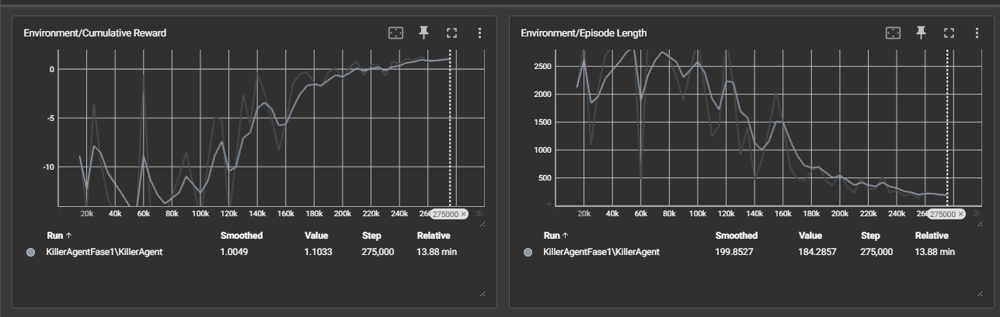

# Escape Of Death – VR Game met ML-Agents

Escape Of Death is een VR-game geïnspireerd op Dead By Daylight, waarin een AI-agent (de "killer") de speler probeert te vinden en te vangen. De speler moet in een virtuele omgeving op zoek naar een sleutel om te ontsnappen. Deze tutorial beschrijft hoe je een eenvoudige VR-omgeving met ML-Agents opzet, hoe de agent leert, en welke resultaten je mag verwachten.

## Inleiding

In dit project combineren we VR-technologie met machine learning. Je leert hoe een AI-agent in Unity getraind wordt om een doelwit te zoeken en te vangen, en hoe de speler in VR interactie heeft met deze omgeving. Aan het einde van deze tutorial begrijp je hoe observaties, acties en beloningen samenkomen in een werkende game.

## Methoden

### Installatie

- Unity versie: 2021.3 LTS
- ML-Agents versie: 2.0.1
- XR Interaction Toolkit: 2.1.1

### Verloop van de simulatie

De game bestaat uit vier kamers. In één kamer wordt willekeurig een target geplaatst, in een andere kamer start de agent. De agent gebruikt raycasts om het doelwit te detecteren, rekening houdend met muren en obstakels. De speler navigeert in VR en zoekt naar de ontsnappingssleutel om de deur te ontgrendelen om nadien te kunnen ontsnappen.

### Observaties, acties en beloningen

- **Observaties:** Posities van muren, obstakels, agent en speler via raycasts.
- **Acties:** Bewegen, draaien, target benaderen(aanvallen).
- **Beloningen:** +1 bij het vangen van het doelwit, -0.01 per stap zonder vangst.

### Objecten en gedragingen

- **Agent (killer):** Zoekt actief naar het doelwit(speler), navigeert rond obstakels en kamers.
- **Speler:** Navigeert in VR, zoekt sleutel om te ontsnappen.
- **Sleutel:** Ontgrendelt de uitgang.

### One-pager (afwijkingen?)

## Resultaten

### Training met Tensorboard

Eerst zien we fluctuaties bij de learning process wat wilt zeggen dat de agent grote veranderingen in de keuzes nam in het begin naarmate de learning process zagen we steeds een grotere stijging in belongingne en begreep de agent beter hoe hij belongingen kon grijpen en hoe hij dit op de snelste manier deed.

De Tensorboard-grafieken tonen dus een duidelijke stijging in cumulatieve beloning en een daling in episode-lengte naarmate de agent leert.
### Opvallende waarnemingen

We kunnen ervan uitgaan dat het testen in de XR orign en het testen van het spel met een effectieve VR headset het spel helemaal anders is. Het geeft het spel valse 'collisions', een vaste root vr speler en veranderede lighting. Dit leert ons dat na het testen met de origin best ook een VR headset gebruikt wordt en we zo testen hoe het uiteindelijk spel aan voelt. 

## Conclusie

We hebben een VR game ontwikkeld waarin een AI agent succesvol leert de speler te vinden en te vangen, terwijl de speler in VR op zoek moet naar een ontsnappingssleutel om te kunnen ontsnappen. De resultaten tonen aan dat de agent efficiënt leert navigeren rond muren en obstakels, en de speler uitdaagt. De combinatie van VR en reinforcement learning biedt een boeiende leeromgeving. In de toekomst kan de omgeving verder uitgebreid worden, bijvoorbeeld door bewegende obstakels, meerdere agenten of extra uitdagingen toe te voegen.
